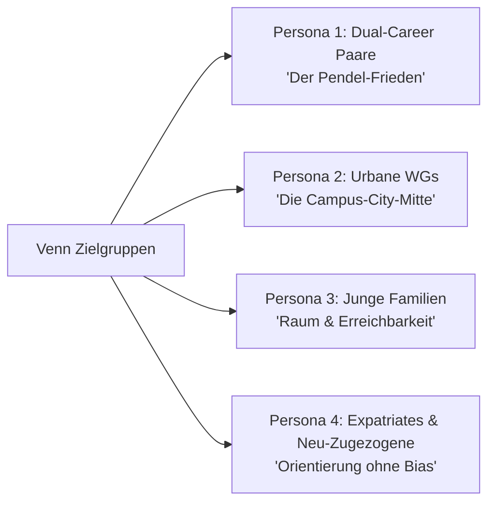
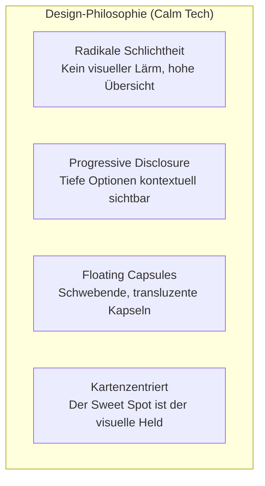
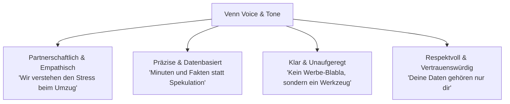

# Venn – Brand Identity & Design System Guide
> **Offizielle Marken-, Design- und Kommunikationsrichtlinie für Venn.**  
> Dieses Dokument definiert die visuelle Sprache, Design-Tokens, Zielgruppen-Personas, Tonalität und Marketing-Konzepte für die Weiterentwicklung des Interfaces, der Dokumentation und externer Kommunikationsmittel.

---

## 1. Executive Summary & Markenidentität

| Attribut | Spezifikation |
| :--- | :--- |
| **Produktname** | **Venn** |
| **Claim / Slogan (EN)** | *Finding common ground* |
| **Claim / Slogan (DE)** | *Finde euer gemeinsames Zuhause* • *Gerechtes Pendeln, gemeinsame Mitte* |
| **Branche / Kategorie** | PropTech, Geo-Mobility, Smart Living, Civic Tech |
| **Produktart** | Interaktive Web-Applikation zur kartenbasierten Wohnbereichsfindung via Fahrzeit-Isochronen |
| **Kern-Mission** | Paaren, WGs und Familien die Suche nach dem idealen Wohnort erleichtern – durch mathematisch faire Schnittmengen aller täglichen Pendelwege, multimodale Mobilitätsanalysen und verlässliche Open-Data-Mietspiegel. |
| **Positionierung** | Der verlässliche, transparente Vermittler im relationalen Wohnungssuch-Dilemma: Faktenbasierte Klarheit statt endloser Pendel-Kompromisse. |

### Die Kernproblematik & Lösung
* **Problem**: Wenn zwei oder mehr Personen zusammenziehen möchten, kollidieren unterschiedliche Arbeits- und Studienorte, verschiedene Verkehrsmittel (Bahn, Auto, Rad) und individuelle Zeitbudgets. Häufig zieht ein Partner den Kürzeren und pendelt täglich 45+ Minuten länger als der andere.
* **Lösung**: Venn berechnet gleichzeitig individuelle Fahrzeit-Polygone (Isochronen) für verschiedene Verkehrsmittel und ermittelt mittels präziser geometrischer Verschneidung (*Turf.js*) den exakten gemeinsamen „Sweet Spot“ (Treffbereich).

### Key Selling Points (USPs)
1. **Multi-Personen-Schnittmenge**: Beliebig viele Personen mit eigenen Startadressen, Verkehrsmitteln und individuellen Maximal-Fahrzeiten.
2. **Topologisches ÖPNV-Modell**: Vollwertiges U- und S-Bahn-Netzmodell (z. B. DELFI / MVV) mit Fußwegen zu Stationen, Taktzeiten und Umstiegsbeschränkungen – kein vereinfachter Luftlinien-Radius.
3. **Mietspiegel-Overlay**: Offizielle kommunale Mietspiegel-Daten (z. B. Open Data der Landeshauptstadt München) direkt über den Erreichbarkeitszonen visualisierbar.
4. **100% Privacy by Design**: Läuft vollständig client-seitig im Browser. Private Suchadressen verbleiben ausschließlich im lokalen Speicher (`localStorage`), ohne serverseitiges Tracking oder Benutzerkontopflicht.
5. **Frei zugänglich (Open Source & No-Login)**: Sofort ohne Registrierung oder Bezahlbarrieren nutzbar; optionaler „Bring Your Own Key“-Modus (BYOK) für erweiterte Routing- und Kartenprovider.

---

## 2. Zielgruppen & Persona-Matrix



### Persona 1: Das berufstätige Paar („Dual-Career Commuters“)
* **Demographie**: 26–38 Jahre, Fachkräfte / Akademiker, leben in oder um Ballungsräume.
* **Konstellation**: Partner A arbeitet im Stadtzentrum (ÖPNV), Partner B an einem Forschungscampus oder Außenstandort (Auto oder Bahn).
* **Pain Point**: Diskussionen um Fairness beim Zusammenziehen: *„Wenn wir in deine Nähe ziehen, brauche ich jeden Morgen eine Ewigkeit.“*
* **Emotionaler Nutzen**: Partnerschaftliche Harmonie, gewonnene Lebenszeit für gemeinsame Abende.
* **Kern-Botschaft**: *„Schluss mit Pendel-Frust in der Beziehung. Findet das Viertel, das für euch beide fair ist.“*

### Persona 2: Die moderne WG („Flatshare Harmony“)
* **Demographie**: 20–30 Jahre, Studierende, Trainees, Berufseinsteiger.
* **Konstellation**: 3 Mitbewohner mit unterschiedlichen Hochschul- und Arbeitsstandorten.
* **Pain Point**: Niemand möchte fahrzeittechnisch abgehängt sein; verlässliche Nacht- und U-Bahn-Anbindung ist Pflicht.
* **Kern-Botschaft**: *„3 Jobs, 3 Unis, 1 Zuhause. Berechnet eure perfekte WG-Zone in Sekunden.“*

### Persona 3: Die wachsende Familie („Space & Mobility Balancers“)
* **Demographie**: 30–42 Jahre, 1–2 Kinder.
* **Konstellation**: Wunsch nach mehr Wohnraum und Grünfläche bei gleichzeitiger Bindung an Arbeitgeber in der Stadt.
* **Pain Point**: Angst vor extremen Pendelzeiten auf überlasteten Einfallsstraßen und unbezahlbaren Quadratmeterpreisen.
* **Kern-Botschaft**: *„Mehr Platz fürs Leben – ohne den halben Tag unterwegs zu sein. Finde bezahlbare Wohnlagen mit optimaler Anbindung.“*

### Persona 4: Expatriates & Neu-Zugezogene („Orientation without Bias“)
* **Demographie**: 24–45 Jahre, Umzug aus einer anderen Stadt oder dem Ausland.
* **Pain Point**: Keine Ortskenntnis, intransparenter Wohnungsmarkt, Abhängigkeit von subjektiven Empfehlungen Dritter.
* **Kern-Botschaft**: *„München verstehen ohne Makler-Vorurteile. Echte Fahrzeiten und offizielle Mietspiegel-Daten auf einen Blick.“*

---

## 3. Visuelles Design-System & Design Tokens

Venn folgt den Prinzipien des **„Calm Tech“**: maximale Funktionalität, radikale Schlichtheit und ein aufgeräumtes, modulares Interface mit hoher visueller Ruhe.



### Farb-Tokens & Semantik (Hex & CSS)

| Farb-Token | Hex-Code | Semantische Bedeutung in Venn |
| :--- | :--- | :--- |
| `--venn-sky` | `#38BDF8` (Light) / `#4285F4` (Brand Mark) | **Primärfarbe**: Klarheit, Weite, ÖPNV, technologische Präzision |
| `--venn-mint` | `#34D399` (Light) / `#34A853` (Brand Mark) | **Sekundärfarbe**: Harmonie, Schnittmenge, Natur & Fahrradmobilität |
| `--venn-lens` | `#00897B` | **Sweet Spot**: Die exakte geometrische Schnittfläche zweier Welten |
| `--venn-pin` | `#EA4335` | **Anker & Fokus**: Der Wohnungs-Pin / das gefundene gemeinsame Zuhause |
| `--mode-transit` | `#0284C7` (Dark: `#38BDF8`) | Öffentlicher Personennahverkehr (U-Bahn, S-Bahn, Tram) |
| `--mode-car` | `#4F46E5` (Dark: `#818CF8`) | Individualverkehr / Autobahnverbindungen |
| `--mode-bike` | `#059669` (Dark: `#34D399`) | Fahrrad-Isochrone & Radschnellwege |
| `--mode-walk` | `#D97706` (Dark: `#FBBF24`) | Fußläufige Nahversorgung & Gehzeiten zu Stationen |
| `--venn-obsidian`| `#020617` / `#0F172A` | Hintergrund & Kontrastflächen im Dark Mode |
| `--venn-canvas` | `#FFFFFF` / `#F8FAFC` | Frischer, klarer Hintergrund im Light Mode |

### Typografie
* **Primäre Schriftfamilie**: `Inter`, `Roboto`, `system-ui`, `-apple-system`, `sans-serif`
* **Stilcharakter**:
  * Geometrisch-humanistisch, nüchtern, optimiert für Lesbarkeit auf dichten Karten-Overlays.
  * Headings: Halbfett (`font-weight: 600`), dezentes negatives Tracking (`-0.02em` bis `-0.03em`) für ein kompaktes, modernes Erscheinungsbild.
  * Daten & Kennzahlen: Monospace-Akzente (`Roboto Mono` oder `ui-monospace`) für Pendelminuten (z. B. `25 min`) und Quadratmeterpreise (`€18.50/m²`).

### UI-Morphologie & Komponenten
* **Schwebende Kapseln (Floating Capsules)**: Konturierte, transluzente Kapseln mit dezentem Schattenwurf (`shadow-sm` bis `shadow-md`) und feinen Rahmen (`border-slate-200/80` bzw. `border-slate-700/80`).
* **Micro-Affordances**: Segmentierte Icon-Buttons, kompakte Modus-Umschalter (Bahn, Auto, Rad, Fuß) mit eindeutigen Farbakzenten.
* **Touch-Ergonomie**: Mindest-Klickflächen von 44 × 44 px, eliminiertes Tap-Delay (`touch-action: manipulation`) und barrierefreie Fokus-Ringe (WCAG 2.4.7 / 2.4.11).

---

## 4. Art Direction & Bildwelten

Für Produktgrafiken, Landingpages, Social-Media-Assets und Präsentationen gelten klare visuelle Leitlinien:

### Ästhetische Leitlinien
* **Licht & Atmosphäre**: Warmes, natürliches Tageslicht (Vormittagssonne oder sanftes Nachmittagslicht). Keine harten Studioblitze oder künstlich überstrahlte Szenen.
* **Architektur & Raum**: Moderne, helle Wohnungen mit Holzböden, Balkone mit Stadtblick, Pflanzen, aufgeräumte Arbeitsbereiche.
* **Authentizität**: Reale, entspannte Momente. Ein Paar, das gemeinsam bei einer Tasse Kaffee auf ein Display blickt und erleichtert lächelt. Personen, die entspannt ihr Fahrrad an einer Station abstellen.
* **Karten-Integration**: Stilisierte, weiche Isochronen-Wellen (Sky-Blue, Mint, Teal) auf Interfaces oder als subtile Hintergrundgrafiken.

### Do's & Don'ts für Visuals
| Erwünscht (Do) | Zu vermeiden (Don't) |
| :--- | :--- |
| Authentische Menschen (25–40 Jahre) in alltäglicher, moderner Kleidung | Gekünstelte „Daumen-hoch“-Stockfotos oder erzwungene Posen |
| Echte Stadtatmosphäre (z. B. Isar-Radweg, U-Bahn-Eingang, Stadtbalkon) | Dunkle, klaustrophobische Stau-Szenarien ohne positive Auflösung |
| Hochwertige Holz-, Glas- und Stein-Texturen | Plastik-Ästhetik oder überladene Bürowelten |
| Sanfte Farbverläufe in Sky-Blue (`#38BDF8`) und Mint (`#34D399`) | Reißerische Neon-Glows, grelles Magenta oder Cyberpunk-Filter |

---

## 5. Brand Voice & Tone of Voice

Venn kommuniziert wie ein **smarter, empathischer Navigator auf Augenhöhe**.



### Die 4 Tonalitäts-Säulen
1. **Empathisch, aber lösungsorientiert**: Wir dramatisieren den Wohnungsmarkt nicht, sondern geben Suchenden die Kontrolle zurück.
2. **Mathematisch elegant, menschlich formuliert**: Wir sagen nicht *„topologischer Dijkstra-Graph mit Isochronen-Turf-Union“*, sondern: *„Wir berechnen genau, wie weit du in 30 Minuten mit der Bahn kommst – und wo ihr euch trefft.“*
3. **Fokus auf Fairness**: Wohnen ist ein partnerschaftliches Projekt. Beide Seiten zählen gleich viel.
4. **Respektvoll gegenüber Privatsphäre**: Datenschutz ist kein Feature, sondern das Fundament.

### Copywriting Dos & Don'ts
* **DO**:
  * *„Wo ihr beide pünktlich zum Abendessen seid.“*
  * *„Eure gemeinsame Mitte in München – berechnet nach echten Fahrzeiten.“*
  * *„100% im Browser. Deine Suchorte bleiben dein Geheimnis.“*
* **DON'T**:
  * Keine leeren Superlative (*„Die revolutionärste Immobilien-Revolution aller Zeiten!“*).
  * Keine Verunsicherung oder Panikmache bzgl. Mietmarkt.
  * Keine bürokratische oder trockene Beamtensprache.

---

## 6. Marketing-Hooks & Kampagnen-Leitfäden

### Kampagne 1: „Der Pendel-Frieden“ (Couples & Fairness)
* **Zielgruppe**: Paare, die zusammenziehen möchten.
* **Kernbotschaft**: Warum soll einer 50 Minuten pendeln und der andere 10? Findet das Viertel, bei dem beide nach 25 Minuten zu Hause sind.
* **Format-Ideen**: Interaktives Vorher-Nachher (Ungleiches Pendeln vs. gemeinsamer Sweet Spot), animierte Isochronen-Schnittmenge.
* **CTA**: *„Berechne eure gemeinsame Mitte kostenlos.“*

### Kampagne 2: „München ohne Blindflug“ (Local Focus & Mietspiegel)
* **Zielgruppe**: Wohnungssuchende im Großraum München (MVV & U-Bahn-Netz).
* **Kernbotschaft**: Kombiniere deine ÖPNV-Fahrzeit mit dem offiziellen Münchner Mietspiegel. Finde bezahlbare Zonen mit direkter S-Bahn-Anbindung.
* **Format-Ideen**: Infografiken mit U-/S-Bahn-Taktung und Mietzonen.
* **CTA**: *„Münchner Wohnlagen entdecken.“*

### Kampagne 3: „WG-Suche ohne Drama“ (Shared Flats)
* **Zielgruppe**: Studierende & Berufseinsteiger (Semesterstart, WG-Neugründung).
* **Kernbotschaft**: 3 Mitbewohner, 3 Ziele (Campus, Arbeit, Sport). Venn berechnet in Sekunden das Viertel, aus dem alle schnell ankommen.
* **Format-Ideen**: Kurze Social Clips über WG-Castings und Fahrzeit-Debatten.
* **CTA**: *„WG-Zone berechnen.“*

### Kampagne 4: „Privacy First Wohnen“ (Trust & Freedom)
* **Zielgruppe**: Datenschutzbewusste Nutzer, Tech-affine Zielgruppen.
* **Kernbotschaft**: Kein Benutzerkonto, kein Passwort, kein Datenverkauf. Deine Adressen verlassen niemals deinen Browser.
* **Format-Ideen**: Übersichtliche Feature-Cards zur Client-Side-Architektur.
* **CTA**: *„Direkt im Browser starten.“*

---

## 7. Universelle Textbausteine & Vorlagen

Diese Textblöcke können für Landingpages, Pressemitteilungen, Social Media oder KI-gestützte Redaktionsworkflows verwendet werden:

### Modul A: Kurzbeschreibung (Elevator Pitch)
```text
Venn ist eine interaktive Web-Anwendung für Paare, WGs und Familien zur Ermittlung des idealen gemeinsamen Wohnorts. Anhand multimodaler Fahrzeit-Isochronen (ÖPNV mit echtem Taktmodell, Auto, Fahrrad, Fußweg) berechnet Venn präzise geometrische Schnittmengen und visualisiert den fairen gemeinsamen Treffbereich. Ergänzt durch offizielle Mietspiegel-Daten und konsequente Privacy-by-Design-Architektur (100% client-seitig, ohne Login) macht Venn Schluss mit unfairen Pendel-Kompromissen.
```

### Modul B: Englischer Profil-Text
```text
Venn is an interactive travel-time isochrone web application designed for couples, flatmates, and families to find their ideal shared residential zone. Using multimodal routing (public transit with real timetable topologies, driving, cycling, and walking), Venn computes exact geometric intersections so no partner carries an unfair commute burden. With built-in municipal rent index overlays and a strict privacy-by-design architecture (100% client-side, zero tracking, no sign-up required), Venn brings clarity and fairness to relocation decisions.
```

### Modul C: Social Ad Copy-Varianten
* **Variante A (Beziehung & Fairness)**:
  * *Headline*: Schluss mit dem Pendel-Streit.
  * *Text*: Wenn einer 15 Minuten zur Arbeit braucht und der andere 55, ist Frust vorprogrammiert. Venn berechnet eure exakte gemeinsame Mitte – für Bahn, Auto oder Fahrrad.
  * *CTA*: Finde euren Sweet Spot. Kostenlos & ohne Login.
* **Variante B (Fakten & Mietspiegel)**:
  * *Headline*: Schneller zur Arbeit. Fairer wohnen.
  * *Text*: Wo treffen sich eure Arbeitswege mit bezahlbaren Mieten? Venn kombiniert echte ÖPNV-Fahrzeiten mit dem offiziellen Mietspiegel.
  * *CTA*: Jetzt gemeinsame Zone berechnen.

---

## 8. Offizielle Logo-Assets

Alle Logo-Assets stehen im Verzeichnis [`public/`](file:///c:/Users/haeri/OneDrive/Coding/Coding/Venn/public/) in Vektor- (SVG) und hochauflösenden Rasterformaten (PNG) mit transparentem Alphakanal zur Verfügung:

| Asset-Datei | Format & Maße | Beschreibung & Einsatzzweck |
| :--- | :--- | :--- |
| **[`venn-logo.png`](file:///c:/Users/haeri/OneDrive/Coding/Coding/Venn/public/venn-logo.png)** | PNG • 1520 × 560 px | Standard-Voll-Logo mit dunkler Wortmarke (`#1F1F1F`) für helle Hintergründe |
| **[`venn-logo-dark.png`](file:///c:/Users/haeri/OneDrive/Coding/Coding/Venn/public/venn-logo-dark.png)** | PNG • 1520 × 560 px | Voll-Logo mit heller Wortmarke (`#F1F3F4`) für dunkle Hintergründe |
| **[`venn-icon.png`](file:///c:/Users/haeri/OneDrive/Coding/Coding/Venn/public/venn-icon.png)** | PNG • 1024 × 1024 px | Quadratische Bildmarke (Venn-Overlap + Pin) für Avatare, Icons und App-Stores |
| **[`venn-logo.svg`](file:///c:/Users/haeri/OneDrive/Coding/Coding/Venn/public/venn-logo.svg)** | SVG (Vektor) | Responsives Vektor-Logo mit automatischer Dark-Mode-Umschaltung |
| **[`venn-logo-dark.svg`](file:///c:/Users/haeri/OneDrive/Coding/Coding/Venn/public/venn-logo-dark.svg)** | SVG (Vektor) | Festes Vektor-Logo für dunkle Oberflächen |
| **[`venn-icon.svg`](file:///c:/Users/haeri/OneDrive/Coding/Coding/Venn/public/venn-icon.svg)** | SVG (Vektor) | Quadratische Vektor-Bildmarke (`viewBox="0 0 100 100"`) |

### Asset-Anwendung & Mindestabstände
* **Schutzraum**: Um das Logo herum sollte stets ein Freiraum von mindestens der Höhe des Buchstaben `V` eingehalten werden.
* **Farbtreue**: Die Primärfarben Blau (`#4285F4`), Grün (`#34A853`), Teal (`#00897B`) und der Korallen-Pin (`#EA4335`) dürfen nicht umgefärbt oder verzerrt werden.
